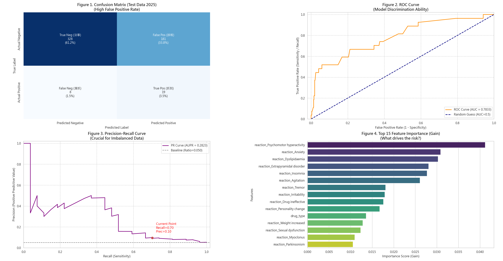
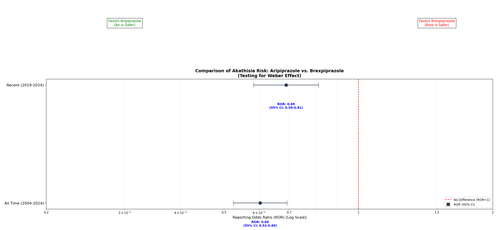

# Risk Prediction of Antipsychotic-Induced Akathisia in Patients with Bipolar Disorder  
### A Machine Learning Study Based on the openFDA Database

---

## Abstract

**Background**  
Akathisia is a common and highly distressing extrapyramidal symptom (EPS) associated with antipsychotic treatment. It often leads to poor medication adherence and has been linked to an increased risk of suicide. Although newer agents such as brexpiprazole are marketed as having a lower risk of EPS, large-scale real-world evidence remains limited.

**Objective**  
This study aimed to evaluate the differential risk of akathisia between the novel agent **brexpiprazole** and the conventional agent **aripiprazole** using the openFDA Adverse Event Reporting System (FAERS), and to develop a machine learning model for individualized risk prediction.

**Methods**  
Bipolar disorder cases reported by healthcare professionals between **2004 and 2025** were included.  
- Disproportionality analysis was conducted to calculate reporting odds ratios (RORs).  
- An **XGBoost-based machine learning model** was constructed and validated using:
  - 5-fold cross-validation  
  - Temporal holdout validation with **2025 data** as an independent test set.

**Results**  
Statistical analysis demonstrated that brexpiprazole was associated with a significantly higher risk of akathisia than aripiprazole:
- Overall ROR = **0.60**
- Post-2019 ROR = **0.69**
- *p* < 0.001  

The machine learning model showed:
- **Micro-AUROC:** 0.7833  
- **Recall:** 70.4%  
- **Precision:** 9.5%

**Conclusion**  
Real-world evidence suggests that the risk of akathisia associated with brexpiprazole may be underestimated. The proposed model, characterized by high recall, may serve as a useful **preliminary clinical screening tool**.

---

## Chapter 1. Introduction

### 1.1 Research Background and Motivation

The treatment of bipolar disorder relies on long-term pharmacological management; however, both diagnosis and treatment remain highly challenging (Nierenberg et al., 2023). Antipsychotic medications constitute a cornerstone of therapy, yet their adverse effects can profoundly impair patients’ quality of life.

Among these, **akathisia** is one of the most common and distressing extrapyramidal symptoms (EPS). Clinically, akathisia manifests as an intense sense of inner restlessness, often leading patients to be misdiagnosed as experiencing *worsening bipolar symptoms* or *acute anxiety*, resulting in inappropriate dose escalation.

Given that patients with bipolar disorder already have an elevated risk of suicide, inadequately managed akathisia may further precipitate psychological collapse (Miller & Black, 2020).

---

### 1.2 Existing Problems and Research Gaps

With advances in psychopharmacology, novel antipsychotic agents such as **brexpiprazole** have been developed. These drugs typically emphasize receptor selectivity or partial agonist properties to reduce EPS-related adverse effects (Tarzian et al., 2023).

However:
- Large-scale **real-world evidence** comparing brexpiprazole and aripiprazole remains scarce.
- In contrast to fields like immunotherapy, psychiatry lacks **individualized adverse event prediction models** and still relies heavily on population-level statistics (Yan et al., 2025).

---

### 1.3 Research Objectives

Using the openFDA database, this study aimed to:

1. Compare the real-world risk of akathisia associated with **aripiprazole** and **brexpiprazole**.  
2. Examine whether the **Weber effect** influences early post-marketing reporting patterns of brexpiprazole.  
3. Develop a **machine learning framework** to predict individual patient risk of developing akathisia.

---

## Chapter 2. Methodology

### 2.1 Data Source and Preprocessing

Data were obtained from the **U.S. FDA open database (openFDA)** Adverse Event Reporting System (**FAERS**).

**Target Adverse Events (MedDRA terms):**
- Akathisia  
- Extrapyramidal disorder  
- Dystonia  
- Tremor  

**Inclusion and Exclusion Criteria:**
- Only reports submitted by **healthcare professionals** were included.
- Cases with age **<10 years or >100 years** were excluded.
- Duplicate reports were removed using report IDs and event dates, retaining only the most recent version.

After preprocessing, the dataset included drug names, active ingredients, and patient demographic characteristics.

*Figure 1. Snapshot of FAERS data after preprocessing (compiled from openFDA).*

---

### 2.2 Statistical Analysis: Disproportionality Analysis

A **case/non-case approach** was employed to calculate:
- Reporting Odds Ratios (RORs)
- 95% confidence intervals  

This enabled detection of treatment-related adverse event signals.

---

### 2.3 Machine Learning Framework

**Model Selection:** XGBoost  

**Validation Strategy:**
- **Training set:** 2004–2024 data with 5-fold cross-validation  
- **Test set:** 2025 data (temporal holdout validation)

**Evaluation Metrics:**
- Primary: **F-beta score (β = 3)**  
- Secondary: Micro-AUROC, Micro-AUPR  

---

## Chapter 3. Results

### 3.1 Drug Risk Comparison: Disproportionality Analysis

Analyses were performed on:
- Full dataset (2004–2024)
- Post-2019 subset (to assess the Weber effect)

*Figure 2. Forest plot comparing akathisia risk between aripiprazole and brexpiprazole. The red dashed line indicates ROR = 1.*

**Key Findings:**
- **All-time period:**  
  - Aripiprazole ROR = 0.60 (95% CI: 0.52–0.69)
- **Post-2019 period:**  
  - Aripiprazole ROR = 0.69 (95% CI: 0.58–0.81)

---

### 3.2 Machine Learning Model Performance

*Figure 3. Model performance on 2025 test data (confusion matrix, ROC, PR curves, feature importance).*

#### 3.2.1 Confusion Matrix Analysis
- **Recall:** 70.4% (19/27 true akathisia cases identified)
- **False positives:** 181
- **Precision:** 9.5%

#### 3.2.2 Overall Discriminative Ability
- **Micro-AUROC:** 0.7833  
- **Micro-AUPR:** 0.2940 (baseline ≈ 0.05)

#### 3.2.3 Feature Importance
Key predictors included:
- Drug type  
- Psychomotor hyperactivity  
- Anxiety  

---

## Chapter 4. Discussion

### 4.1 Pharmacological Expectations vs. Real-World Evidence

Despite brexpiprazole’s theoretical advantage via strong 5-HT1A affinity, FAERS data revealed a higher risk of akathisia. This discrepancy suggests potential **selection bias in clinical trials**.

---

### 4.2 Verification of the Weber Effect

ROR increased from **0.60 (all-time)** to **0.69 (post-2019)**, indicating partial Weber effect influence. However, risk remained significantly elevated beyond reporting bias alone.

---

### 4.3 Clinical Positioning: High-Sensitivity Screening

**Strength:**  
- High recall (70.4%) enables effective early risk screening.

**Limitation:**  
- Low precision (9.5%) may cause alert fatigue.  
- Model outputs should be interpreted as **risk alerts**, not diagnoses.

---

### 4.4 Study Limitations

- **Class imbalance:** Akathisia prevalence ≈ 5%  
- **Concept drift:** Test-set AUPR declined (0.40 → 0.29)

---

## Chapter 5. Conclusion

Brexpiprazole is associated with a higher real-world risk of akathisia than aripiprazole, and this finding cannot be fully explained by the Weber effect. Despite a high false-positive rate, the proposed model’s strong sensitivity makes it a valuable tool for identifying high-risk patients. Clinicians should remain vigilant when prescribing brexpiprazole.

---

## References

- Miller, J. N., & Black, D. W. (2020). Bipolar disorder and suicide: A review. *Current Psychiatry Reports*, 22(2), 6.  
- Nierenberg, A. A., et al. (2023). Diagnosis and treatment of bipolar disorder: A review. *JAMA*, 330(14), 1370–1380.  
- Tarzian, M., et al. (2023). Cariprazine for treating schizophrenia, mania, bipolar depression, and unipolar depression. *Cureus*, 15(5), e39309.  
- Yan, D., et al. (2025). Plasma proteome-driven liquid biopsy for individualized monitoring. *Molecular & Cellular Proteomics*, 101488.  
- U.S. Food and Drug Administration (openFDA). FAERS database statistics and documentation.
